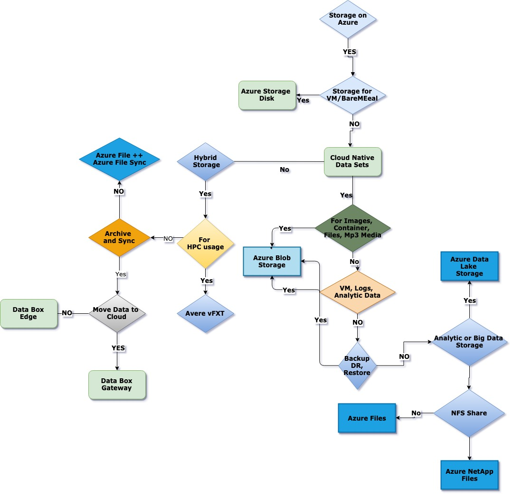
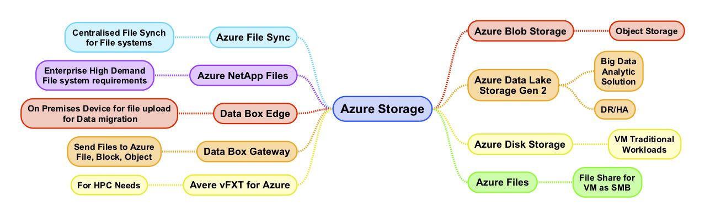
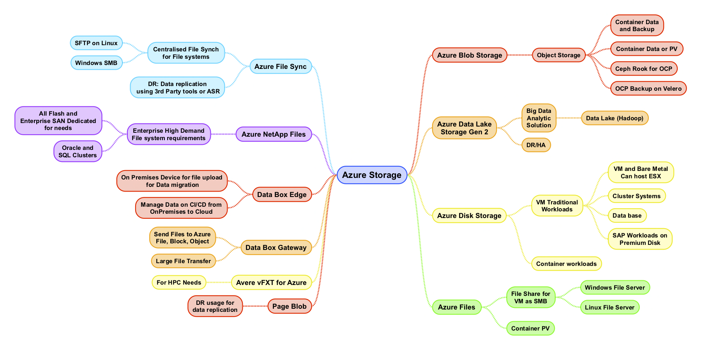

# Table of Contents

[Azure Storage design considerations and decisions 2](#_Toc14256741)

[Azure Storage Selection Decision 2](#azure-storage-selection-decision)

[Azure storage services 3](#azure-storage-services)

[Azure Common Storage Use Cases 5](#azure-common-storage-use-cases)

[Block storage scenarios 6](#block-storage-scenarios)

[File and object storage Use cases
8](#file-and-object-storage-use-cases)

[Data workload planning 10](#data-workload-planning)

[Deciding when to use Azure Blobs, Azure Files, or Azure Disks
11](#deciding-when-to-use-azure-blobs-azure-files-or-azure-disks)

[Scenarios 11](#scenarios)

[References 11](#references)

# 

# 

# 

# 

# 

# 

# 

# 

# 

# 

# 

# Azure Storage design considerations and decisions

This article is focused on Storage consideration and picking up right
kind of storage for the workloads

## Azure Storage Selection Decision 

-   **I need storage for Virtual Machines.**

    -    Azure Disk Storage is used to provide virtual disk capabilities
        for IaaS virtual machines. [Azure Disk
        Storage](https://docs.microsoft.com/en-us/azure/virtual-machines/windows/managed-disks-overview)
        here.

-   **I need access to files, images, media, container data?** 

    -   Azure Blob Storage provides the ability to [host static
        files](https://github.com/MicrosoftDocs/architecture-center/blob/master/azure/storage/blobs/storage-blob-static-website),
        which are then accessible for download over the Internet.

    -   Assets hosted in Blob Storage can be made public, or [limited to
        users
        authorized](https://github.com/MicrosoftDocs/architecture-center/blob/master/azure/storage/common/storage-auth) via
        Azure Active Directory, shared keys, or shared access
        signatures, more details on [Azure Blob
        Storage](https://docs.microsoft.com/en-us/azure/storage/blobs/storage-blobs-introduction)
        here.

-   **I have log files to store for virtual machine or application logs
    and analytics data?** 

    -   Azure Blob Storage can also be used to [store Azure Monitor log
        data](https://docs.microsoft.com/en-us/azure/storage/blobs/storage-blobs-introduction).

-   **I need storage for backup, disaster recover, or archiving
    workload?** 

    -   Azure Blob Storage is used by Azure Disk Storage to
        provide [backup and disaster recovery
        capabilities](https://docs.microsoft.com/en-us/azure/virtual-machines/windows/backup-and-disaster-recovery-for-azure-iaas-disks).

    -   Blob storage can also be used as a location to back up other
        resources, such as on-premises or IaaS VM-hosted [SQL Server
        data](https://docs.microsoft.com/sql/relational-databases/backup-restore/sql-server-backup-and-restore-with-microsoft-azure-blob-storage-service?view=sql-server-2017).

-   **What kind of storage should I consider for large data warehouse
    applications i.e. big data analytics workloads?** 

    -   [Azure Data Lake Storage Gen
        2](https://github.com/MicrosoftDocs/architecture-center/blob/master/azure/storage/blobs/data-lake-storage-introduction) which
        is built on top of Azure Blob Storage is capable of supporting
        large enterprise data lake functionality, and can handle storing
        petabytes of information while sustaining hundreds of gigabits
        of throughput.

-   **What is the right storage for enterprise class or cloud native
    file shares?** 

    -   Azure has two primary services providing cloud-hosted file
        shares. 

    -   [Azure NetApp
        Files](https://github.com/MicrosoftDocs/architecture-center/blob/master/azure/azure-netapp-files/azure-netapp-files-introduction) provides
        high-performance NFS shares well suited to common enterprise
        workloads such as SAP. 

    -   [Azure
        Files](https://github.com/MicrosoftDocs/architecture-center/blob/master/azure/storage/files/storage-files-introduction) provides
        file shares accessible over SMB 3.0 and HTTPS.

-   **What is the storage for high-performance computing (HPC)
    workloads?**

    -    [Avere vFXT for
        Azure](https://github.com/MicrosoftDocs/architecture-center/blob/master/azure/avere-vfxt/avere-vfxt-overview) provides
        a hybrid caching solution allowing you to expand your
        on-premises storage capabilities using cloud-based storage.

-   **What is the storage for ftp of my on premises storage to cloud and
    large scale archive.**

    -    [Azure Data
        Box](https://github.com/MicrosoftDocs/architecture-center/blob/master/azure/databox-family) products
        are designed to help move large amounts of data from your
        on-premises environment to the cloud. 

    -   [Data Box
        Gateway](https://github.com/MicrosoftDocs/architecture-center/blob/master/azure/databox-online/data-box-gateway-overview) is
        a virtual device that resides on-premises that helps to manage
        large-scale data migration to the cloud. If you need to analyze,
        transform, or filter data before moving it to the cloud. 

    -   [Data Box
        Edge](https://github.com/MicrosoftDocs/architecture-center/blob/master/azure/databox-online/data-box-edge-overview) is
        an AI-enabled physical edge computing device deployed to your
        on-premises environment to accelerate processing and secure
        transfer of data to Azure.

-   **Do you want to expand an existing on-premises file share to take
    advantage of cloud storage?** 

    -   [Azure File
        Sync](https://github.com/MicrosoftDocs/architecture-center/blob/master/azure/storage/files/storage-sync-files-deployment-guide)
        allows you to use the Azure Files service as an extension of
        files shares hosted on your on-premises Windows Server machines.
        This syncing service transforms Windows Server into a quick
        cache of your Azure file share, and allows your on-premises
        machines to access this share use any protocol that's available
        on Windows Server.

## Azure storage services

Storage options on Azure Cloud

Storage descriptions

<table>
<thead>
<tr class="header">
<th><strong>Service                        </strong></th>
<th><strong>Description</strong></th>
</tr>
</thead>
<tbody>
<tr class="odd">
<td><a href="https://docs.microsoft.com/en-us/azure/storage/blobs/storage-blobs-introduction">Azure Blob Storage</a></td>
<td>
Azure Blob storage is object storage solution Azure.

Blob storage is optimized for storing massive amounts of unstructured data.

Unstructured data is data that does not adhere to a particular data model or definition, such as text or binary data. 
This can use used for

<ul>
<li><blockquote>

Serving images or documents directly to a browser.

</blockquote></li>
<li><blockquote>

Storing files for distributed access.

</blockquote></li>
<li><blockquote>

Streaming video and audio.

</blockquote></li>
<li><blockquote>

Writing to log files.

</blockquote></li>
<li><blockquote>

Storing data for backup and restore, disaster recovery, and archiving.

</blockquote></li>
<li><blockquote>

Storing data for analysis by an on-premises or Azure-hosted service.

</blockquote></li>
</ul></td>
</tr>
<tr class="even">
<td><a href="https://docs.microsoft.com/en-us/azure/storage/blobs/data-lake-storage-introduction">Azure Data Lake Storage Gen 2</a> </td>
<td>
Blob storage supports Azure Data Lake Storage Gen2, which is big data analytics solution for the cloud.

Azure Data Lake Storage Gen2 offers a hierarchical file system as well as the advantages of Blob storage, including low-cost, tiered storage; high availability; strong consistency; and disaster recovery capabilities.
</td>
</tr>
<tr class="odd">
<td><a href="https://docs.microsoft.com/en-us/azure/virtual-machines/windows/managed-disks-overview">Azure Disk Storage</a></td>
<td>
Azure Disk Storage offer persistent, high-performance block storage to power your Azure Virtual Machines. Azure disks are highly durable, secure, and offer the industry’s only single instance SLA for VMs using premium or Ultra SSDs .

Azure disks provide high availability with Availability Sets and Availability Zones that map to your Azure Virtual Machines fault domains. In addition, Azure disks are managed as a top-level resource in Azure providing Azure Resource Manager capabilities like role-based access control (RBAC), policy, and tagging by default.
</td>
</tr>
<tr class="even">
<td><a href="https://docs.microsoft.com/en-us/azure/storage/files/storage-files-planning">Azure Files</a> </td>
<td>Azure Files provides fully managed, native SMB file shares as a service—without the need to run a VM. You can mount an Azure Files share as a network drive to any Azure VM or on-premises machine.</td>
</tr>
<tr class="odd">
<td><a href="https://docs.microsoft.com/en-us/azure/storage/files/storage-sync-files-planning">Azure File Sync</a></td>
<td>Azure File Sync can be used to centralize your organization's file shares in Azure Files, while keeping the flexibility, performance, and compatibility of an on-premises file server. Azure File Sync transforms Windows Server into a quick cache of your Azure file share.</td>
</tr>
<tr class="even">
<td><a href="https://docs.microsoft.com/en-us/azure/azure-netapp-files/azure-netapp-files-introduction">Azure NetApp Files</a> </td>
<td>The Azure NetApp Files service is an enterprise-class, high-performance, metered file storage service. Azure NetApp Files supports any workload type and is highly available by default. You can select service and performance levels and set up snapshots through the service.</td>
</tr>
<tr class="odd">
<td><a href="https://docs.microsoft.com/en-us/azure/databox-online/data-box-edge-overview">Data Box Edge</a></td>
<td>Data Box Edge is an on-premises network device that moves data into and out of Azure and has AI-enabled edge compute to preprocess data during upload. Data Box Gateway is a virtual version of the device with the same data transfer capabilities.</td>
</tr>
<tr class="even">
<td><a href="https://docs.microsoft.com/en-us/azure/databox-online/data-box-gateway-overview">Data Box Gateway</a></td>
<td>Azure Data Box Gateway is a storage solution that enables you to seamlessly send data to Azure. Data Box Gateway is a virtual device based on a virtual machine provisioned in your virtualized environment or hypervisor. The virtual device resides in your premises and you write data to it using the NFS and SMB protocols. The device then transfers your data to Azure block blob, page blob, or Azure Files.</td>
</tr>
<tr class="odd">
<td><a href="https://docs.microsoft.com/en-us/azure/avere-vfxt/avere-vfxt-overview">Avere vFXT for Azure</a></td>
<td>Avere vFXT for Azure is a filesystem caching solution for data-intensive high-performance computing (HPC) tasks. Take advantage of cloud computing's scalability to make your data accessible when and where it's needed—even for data that’s stored in your own on-premises hardware.</td>
</tr>
</tbody>
</table>

## Azure Common Storage Use Cases

### Block storage scenarios

<table>
<thead>
<tr class="header">
<th><strong>Use Case</strong></th>
<th><strong>Considerations for suggested services</strong></th>
<th><strong>Suggested Azure services</strong></th>
</tr>
</thead>
<tbody>
<tr class="odd">
<td><strong>Bare metal servers or VMs (Hyper-V or VMware)</strong> and need access to the Storage as Direct attached.</td>
<td>For production services, premium SSDs provide consistent low-latency coupled with high IOPS and throughput.</td>
<td><u>Azure Disk Storage (premium SSD)</u></td>
</tr>
<tr class="even">
<td>Web Servers or Mobile Apps which need Standard IOPS access</td>
<td>Standard SSD IOPS and throughput might be sufficient (at a lower cost than premium SSDs) for CPU bound web/app servers in production.</td>
<td><u>Azure Disk Storage (standard SSD)</u></td>
</tr>
<tr class="odd">
<td><strong>Need enterprise SAN or all-flash array (AFA).</strong></td>
<td>Ultra SSDs are NVMe-based, offer sub millisecond latency with high IOPS and bandwidth, and are scalable up to 64 TiB. Choice of premium SSD versus ultra SSD depends on peak latency, IOPS, and scalability requirements.</td>
<td>Azure Disk Storage (premium or ultra SSD)  
Azure NetApp Files 
Azure Files (premium)</td>
</tr>
<tr class="even">
<td><strong>Setup as HA clustered servers</strong> (or Large Database which high IOPS</td>
<td>Clustered workloads require multiple nodes to mount the same underlying shared storage for failover or high availability. Premium file shares offer shared storage mountable via SMB. Shared block storage can also be configured on premium or ultra SSDs using partner solutions.</td>
<td>Azure Disk Storage (premium or ultra SSD)</td>
</tr>
<tr class="odd">
<td>Relational Database</td>
<td>Choice of premium SSD versus ultra SSD depends on peak latency, IOPS, and scalability requirements. Ultra SSDs also reduce complexity by removing the need for Storage Pool configuration for scalability (see details).</td>
<td><a href="https://github.com/MicrosoftDocs/architecture-center/blob/master/azure/virtual-machines/windows/disks-types">Azure Disk Storage (premium or ultra SSD)</a></td>
</tr>
<tr class="even">
<td>Containers with persistent volumes.</td>
<td>
File (RWX) and block (RWO) volumes driver options available for both AKS and custom Kubernetes deployments. Persistent volumes (PVs) can map to either an Azure Disk Storage disk or managed Azure Files share. Choose premium versus standard options base on workload PV requirements.

OpenShift 3.x and 4.x are fit for purpose.
</td>
<td><a href="https://github.com/MicrosoftDocs/architecture-center/blob/master/azure/storage/files/storage-files-planning">Azure Files (standard or premium)  
Azure Disk Storage (standard, premium, or ultra SSD)</a></td>
</tr>
<tr class="odd">
<td>Data lake (such as a Hadoop cluster for HDFS data).</td>
<td>The Azure Data Lake Storage (ADLS) Gen 2 feature of Azure Blob Storage provides server-side HDFS compatibility and petabyte scale for parallel analytics along with HA and reliability. Software like Cloudera can also use premium or standard SSDs on master/worker nodes if needed.</td>
<td><a href="https://github.com/MicrosoftDocs/architecture-center/blob/master/azure/storage/blobs/data-lake-storage-introduction">Azure Data Lake Storage Gen 2  
Azure Disk Storage (standard or premium SSD)</a></td>
</tr>
<tr class="even">
<td>SAP or SAP HANA deployment.</td>
<td>Ultra SSDs are optimized to offer sub millisecond latency for tier-1 SAP workloads. Ultra SSDs are now in preview. Premium SSDs coupled with M-Series offer a GA option.</td>
<td>Azure Disk Storage (premium or ultra SSD)</td>
</tr>
<tr class="odd">
<td>DR site with strict RPO/RTO that syncs from my primary servers.</td>
<td><a href="https://github.com/MicrosoftDocs/architecture-center/blob/master/azure/virtual-machines/windows/backup-and-disaster-recovery-for-azure-iaas-disks">Page blobs are used by replication software to enable low-cost replication to Azure without the need for compute VMs until failover occurs. Details can be found in the Azure Disk Storage documentation. Note: Page blobs support a maximum of 8 TB.</a></td>
<td><a href="https://github.com/MicrosoftDocs/architecture-center/blob/master/azure/storage/blobs/storage-blob-pageblob-overview">Page blobs</a></td>
</tr>
</tbody>
</table>

### File and object storage Use cases

<table>
<thead>
<tr class="header">
<th><strong>Use Case</strong></th>
<th><strong>Recommendations and design considerations</strong></th>
<th><strong>Azure Service(s)</strong></th>
</tr>
</thead>
<tbody>
<tr class="odd">
<td>Windows File server or Linux FTP Server</td>
<td>With Azure File Sync, you can store rarely used data on cloud-based Azure file shares while caching your most frequently used files on-premises for fast, local access performance. You can also use multisite sync to keep files in sync across multiple servers. If you plan to migrate your workload to a cloud-only deployment, Azure Files may be sufficient.</td>
<td><a href="https://docs.microsoft.com/en-us/azure/storage/files/storage-files-planning"><u>Azure Files  
Azure File Sync</u></a></td>
</tr>
<tr class="even">
<td>Enterprise SAN equivalent or high IOPS requirements</td>
<td>If you have an on-premises deployment of NetApp, consider Azure NetApp Files to migrate deployment to Azure. If you are using or migrating to a Windows or Linux server or have basic functionality needs from a file share, consider Azure Files; for continued on-premises access, use Azure File Sync to Azure file shares with on-premises using a cloud tiering mechanism.</td>
<td><a href="https://docs.microsoft.com/en-us/azure/azure-netapp-files/azure-netapp-files-introduction"><u>Azure NetApp Files  
Azure Files (premium)</u></a></td>
</tr>
<tr class="odd">
<td>File Share on NFS</td>
<td>Choice of premium versus standard Azure Files tiers depends on IOPS, throughput, and latency consistency needs. If you have an on-premises deployment of NetApp, consider Azure NetApp Files. If you need to migrate your ACLs and timestamps to the cloud, Azure File Sync can bring all of these settings to your Azure file shares as a convenient migration path.</td>
<td><a href="https://docs.microsoft.com/en-us/azure/storage/files/storage-files-planning"><u>Azure Files (standard or premium)  
Azure NetApp Files</u></a></td>
</tr>
<tr class="even">
<td>Object Storage for Backup, container, images, database, unstructured</td>
<td> Azure Blob Storage provides premium, hot, cool, and archive tiers to match your workloads performance and cost needs.</td>
<td><a href="https://docs.microsoft.com/en-us/azure/storage/blobs/storage-blobs-introduction"><u>Azure Blob Storage</u></a></td>
</tr>
<tr class="odd">
<td>I have a DFSR deployment or other way of handling branch offices.</td>
<td>Azure File Sync offers multisite sync to keep files in sync across multiple servers and native Azure file shares in the cloud. Get to a fixed storage footprint on-premises by using cloud tiering, which transforms your server into a cache for the relevant files while scaling cold data in Azure file shares.</td>
<td><a href="https://docs.microsoft.com/en-us/azure/storage/files/storage-files-planning"><u>Azure Files  
Azure File Sync</u></a></td>
</tr>
<tr class="even">
<td>Long Term retention of Data</td>
<td> Archive tier will have the lowest possible cost but can require hours to copy the offline data to a cool, hot, or premium tier of storage to allow access. Cool tier provides instantaneous access at low cost.</td>
<td><a href="https://docs.microsoft.com/en-us/azure/storage/blobs/storage-blob-storage-tiers"><u>Azure Blob Storage (Cool or Archive tiers)</u></a></td>
</tr>
<tr class="odd">
<td>For backup of data or containers or records</td>
<td>To back up data for long-term retention with lowest-cost storage, move data to Azure Blob Storage and use Cool and Archival tiers. To enable fast disaster recovery for file data on a server (on-premises or Azure VM), sync shares to individual Azure file shares via Azure File Sync. With Azure file share snapshots, you can restore previous versions and sync them back to connected servers or access them natively in the Azure file share.</td>
<td><a href="https://docs.microsoft.com/en-us/azure/storage/blobs/storage-blob-storage-tiers">Azure Blob Storage (Cool or Archive tiers) </a></td>
</tr>
<tr class="even">
<td>Data replication to a disaster recovery (DR) site.</td>
<td>Azure File Sync removes the need for a DR server and stores files in native Azure SMB shares. Fast Disaster Recovery will rebuild any data on a failed on-premises server quickly. You can even keep multiple server locations in sync or use cloud tiering to store only relevant data on-premises.</td>
<td><a href="https://docs.microsoft.com/en-us/azure/storage/files/storage-files-planning"><u>Azure Files  
Azure File Sync</u></a></td>
</tr>
<tr class="odd">
<td>data transfer to cloud from my DC</td>
<td>Using Data Box Edge/Gateway you can copy data in disconnected scenarios. When the gateway is offline it will save all files you copy in the cache, then upload when you’re connected.</td>
<td><a href="https://docs.microsoft.com/en-us/azure/databox-online"><u>Azure Data Box Edge/Gateway</u></a></td>
</tr>
<tr class="even">
<td>I manage an ongoing data pipeline to the cloud</td>
<td>Move data to the cloud from systems that are constantly generating data just by having them copy that data straight to the Storage Gateway. If they need to access that data later, it’s right there where they put it.</td>
<td><a href="https://docs.microsoft.com/en-us/azure/databox-online"><u>Azure Data Box Edge/Gateway</u></a></td>
</tr>
<tr class="odd">
<td>Large data burst for analysis</td>
<td>Manage large quantities of data that show up all at once, like when an autonomous car pulls back into the garage, or a gene sequencing machine finishes its analysis. Copy all that data to the Azure Data Box Gateway at fast local speeds then let Gateway upload it as your network allows</td>
<td><a href="https://docs.microsoft.com/en-us/azure/databox-online"><u>Azure Data Box Edge/Gateway</u></a></td>
</tr>
</tbody>
</table>

### Data workload planning

<table>
<thead>
<tr class="header">
<th><strong>Use cases</strong></th>
<th><strong>Suggested Azure Service(s)</strong></th>
</tr>
</thead>
<tbody>
<tr class="odd">
<td>Developing a new cloud-native application that needs to persist unstructured data.</td>
<td><a href="https://docs.microsoft.com/en-us/azure/storage/blobs/storage-blobs-introduction"><u>Azure Blob Storage</u></a></td>
</tr>
<tr class="even">
<td>Migrating data from an on-premises NetApp to Azure.</td>
<td><a href="https://docs.microsoft.com/en-us/azure/azure-netapp-files/azure-netapp-files-introduction"><u>Azure NetApp Files</u></a></td>
</tr>
<tr class="odd">
<td>Migrating data from an on-premises Windows File Servers to Azure.</td>
<td><a href="https://docs.microsoft.com/en-us/azure/storage/files/storage-files-planning"><u>Azure Files</u></a></td>
</tr>
<tr class="even">
<td>Move file data to the cloud but continue to primarily access the data from on-premises.</td>
<td><a href="https://docs.microsoft.com/en-us/azure/storage/files/storage-files-planning"><u>Azure Files  or Azure File Sync</u></a></td>
</tr>
<tr class="odd">
<td>"Burst compute" - NFS/SMB read-heavy file-based workloads with data assets residing on-premises while computation runs in the cloud.</td>
<td><a href="https://docs.microsoft.com/en-us/azure/avere-vfxt/avere-vfxt-overview"><u>Avere vFXT for Azure</u></a></td>
</tr>
<tr class="even">
<td>Move an on-premises application that uses local disk or iSCSI.</td>
<td><a href="https://docs.microsoft.com/en-us/azure/virtual-machines/windows/managed-disks-overview"><u>Azure Disk Storage</u></a></td>
</tr>
<tr class="odd">
<td>Migrate a container-based application with persistent volumes.</td>
<td><a href="https://docs.microsoft.com/en-us/azure/virtual-machines/windows/managed-disks-overviews"><u>Azure Disk Storage  
Azure Files</u></a></td>
</tr>
<tr class="even">
<td>Move file shares to the cloud that are not Windows Server or NetApp.</td>
<td><a href="https://docs.microsoft.com/en-us/azure/storage/files/storage-files-planning"><u>Azure Files  or Azure NetApp Files</u></a></td>
</tr>
<tr class="odd">
<td>Transfer terabytes to petabytes of data from on-premises to Azure.</td>
<td><a href="https://docs.microsoft.com/en-us/azure/databox-online/data-box-edge-overview"><u>Data Box Edge</u></a></td>
</tr>
<tr class="even">
<td>Process data before transferring to Azure.</td>
<td><a href="https://docs.microsoft.com/en-us/azure/databox-online/data-box-edge-overview"><u>Data Box Edge</u></a></td>
</tr>
<tr class="odd">
<td>Continuous ingestion of data in an automated way with local cache.</td>
<td><a href="https://docs.microsoft.com/en-us/azure/databox-online/data-box-gateway-overview"><u>Data Box Gateway</u></a></td>
</tr>
</tbody>
</table>

### Deciding when to use Azure Blobs, Azure Files, or Azure Disks

Microsoft Azure provides several features in Azure Storage for storing
and accessing your data in the cloud. This article covers Azure Files,
Blobs, and Disks, and is designed to help you choose between these
features.

### Scenarios

The following table compares Files, Blobs, and Disks, and shows example
scenarios appropriate for each.

<table>
<thead>
<tr class="header">
<th><strong>Feature</strong></th>
<th><strong>Description</strong></th>
<th><strong>When to use</strong></th>
</tr>
</thead>
<tbody>
<tr class="odd">
<td><strong>Azure Files</strong></td>
<td>Provides an SMB interface, client libraries, and a REST interface that allows access from anywhere to stored files.</td>
<td>You want to "lift and shift" an application to the cloud which already uses the native file system APIs to share data between it and other applications running in Azure. 
You want to store development and debugging tools that need to be accessed from many virtual machines.</td>
</tr>
<tr class="even">
<td><strong>Azure Blobs</strong></td>
<td>Provides client libraries and a REST interface that allows unstructured data to be stored and accessed at a massive scale in block blobs. 
Also supports Azure Data Lake Storage Gen2 for enterprise big data analytics solutions.</td>
<td>You want your application to support streaming and random access scenarios. 
You want to be able to access application data from anywhere. 
You want to build an enterprise data lake on Azure and perform big data analytics.</td>
</tr>
<tr class="odd">
<td><strong>Azure Disks</strong></td>
<td>Provides client libraries and a REST interface that allows data to be persistently stored and accessed from an attached virtual hard disk.</td>
<td>You want to lift and shift applications that use native file system APIs to read and write data to persistent disks. 
You want to store data that is not required to be accessed from outside the virtual machine to which the disk is attached.</td>
</tr>
</tbody>
</table>

## References 

Visit Azure documentation.
